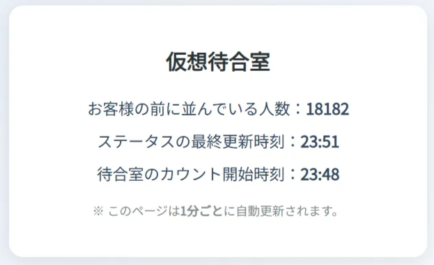

# 仮想待合室アプリ（中学校数学教材）

中学生に「数学の使い道」を身近に感じてもらうために開発した、**リアルな仮想待合室のシミュレーションアプリ**です。

---

## 🎯 このアプリの目的

「なぜ数学を勉強しなければいけないのか？」
「将来、これって使うの？」

──そんな問いに、**実生活の中で数学がどう使われているか**を伝えるのは大きな課題です。

本アプリでは、**チケット購入の仮想待合室の仕組み**を通して、順番処理や確率、アルゴリズム的思考などを学べる教材として設計しています。

---

## 🧪 私の実体験から

2025年3月に実際に東京ドームで行われたメジャーリーグ開幕戦のチケット購入体験をヒントに制作。  
「いつ自分の順番が来るのか？」という体験は、**数理的な思考（モデル化、推論）**を育む良い題材になると感じました。

---

## 🛠 使用技術

- Python（Flask）  
- HTML / CSS / JavaScript  
- シンプルなキュー処理アルゴリズム（待ち時間シミュレーション）  
- レスポンシブ対応（PC / タブレット）

---

## 🚀 デモ

👉 [仮想待合室アプリを試す](https://kk-edu-tech.github.io/kasou-room/)  
👉 [Notion 解説ページを見る](https://raspy-store-96c.notion.site/24288083f5268078a675dd9345b47b4d?source=copy_link)

---

## 🔍 主な機能

- チケット購入を模した仮想待合室シミュレーション
- リロードによって順番の変動を観察できる
- 簡易なログ出力（今の順番・待ち人数など）
- 授業で活用しやすいシンプルUI

---

## 📸 スクリーンショット

---

## 📚 教育的な活用例

- 「待ち時間」を題材にした数学の授業
- 順序・確率・モデル思考の導入
- ICT教材・探究学習のきっかけに

---

## 🙋‍♂️ 作者

- **名前**：kk-edu-tech  
- **職業**：中学校数学教員  
- **ポートフォリオ**：[Notionページ](https://raspy-store-96c.notion.site/kk-edu-tech-24288083f526807ea506d0358fb1b94c?source=copy_link)  
- **GitHub**：[kk-edu-tech](https://github.com/kk-edu-tech)

---

## 📄 ライセンス

このプロジェクトは [MIT ライセンス](LICENSE) のもとで公開されています。
